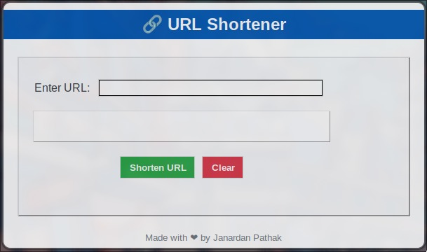
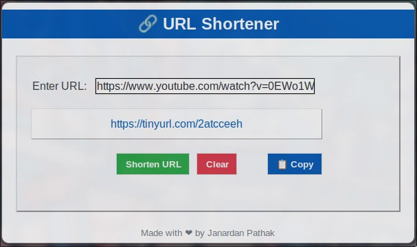

````markdown
# 🔗 URL Shortener

A **GUI-based URL Shortener** application built using Python and Tkinter. This tool allows users to convert long URLs into shorter, more manageable links using the TinyURL API.

---

## 🌟 Features

- 🖱️ **User-Friendly Interface**: Simple and clean GUI for quick URL shortening.
- 📋 **Copy to Clipboard**: Easily copy the shortened URL with a single click.
- 🚀 **Real-Time Results**: Get your shortened URL instantly after entering the long URL.
- 🗑️ **Clear Fields**: Clear the input and result fields with one button.

---

## 🚀 How to Use

1. Clone or download the repository.
2. Install the required library:

   ```bash
   pip install requests
   ```

3. Run the script:
   ```bash
   python url_shortener.py
   ```
4. Enter the URL you want to shorten in the input field.
5. Click **Shorten URL** to generate a shortened link.
6. Click the link to copy it to the clipboard or use the 📋 **Copy** button.
7. Use the **Clear** button to reset the fields.

---

## 📂 Project Structure

- **`url_shortener.py`**: Main Python script for the application.
- **`screenshots/`**: Contains screenshots of the application for reference.

---

## 📸 Screenshots

### Main Interface



### Shortened URL



---

## ❤️ About

This project is built with love and aims to simplify URL shortening. Why type out long URLs when you can shrink them?
````
